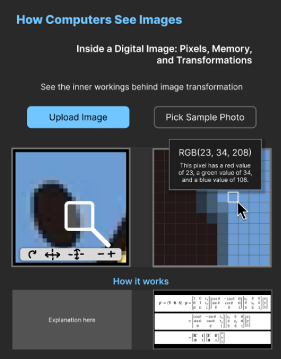

# Inside a Digital Image: How Computers Store and Transform Visual Data

### Project Theme: **Digital Image Processing**

---

## Members
- Chu, Avery Simone  
- Saguin, VL Kirsten Camille "Kei"  
- Sia, Justin Michael  
- Sy, Prince Matthew  
- Tan, Paul Aiden  

---

## Overview

Every digital image undergoes a series of steps before it appears on a screen. Images may be stored in formats such as **PNG**, **BMP**, **HEIC**, etc, each using different methods for organizing and compressing data. However, before an image can be displayed or modified, the computer must **decode the file** and load its contents into memory as **pixel data**.

Once in memory, the image is represented as **numerical values** describing the color and transparency of each pixel, allowing the computer to perform processing operations regardless of the original file format.

This exhibit allows visitors to explore how computers represent and manipulate digital images through an **interactive simulation**. Users can upload or select an image, zoom into specific regions, and examine individual pixels within an enlarged pixel grid. A **format representation module** explains how common image formats differ in storage and compression while demonstrating that they ultimately become pixel data when loaded into memory.

By selecting individual pixels, users can inspect their:
- RGB values
- Opacity
- Hexadecimal and binary representations
- How those values are stored in memory

Visitors can also apply **image processing operations** such as grayscale conversion, brightness adjustment, scaling, and rotation while viewing the **mathematical formulas and matrix transformations** that drive these changes.

---

## Key Features

### Image Input
- Upload an image or select from a set of sample images
- Interactive **split-screen interface** displaying the original image and a data exploration panel
- **Region selection tool** for zooming into specific areas of an image
- Enlarged **pixel grid** for visualizing individual pixels and their spatial arrangement

### Image Format Representation Module
Supports:
- **PNG**
- **BMP**
- **HEIC**
- **JPG**

Educational comparison includes:
- **How image data is stored**
- **Compression methods used by each format**
- **Transparency support**
- **Relative storage requirements**
- How image files are **decoded into pixel data**

### Image Pipeline Visualization
1. Storage Device  
2. Image File  
3. Decoding Process  
4. Memory Representation  
5. Display Output  

### Interactive Pixel Inspection Tool
Activated when a pixel is selected, displaying:
- Pixel coordinates
- **RGB values**
- **HSB and HSL values**
- **Opacity (Alpha) values**
- **Hexadecimal representation**
- **Binary representation**
- Approximate memory layout of the pixel's data

### Memory Representation Visualization
Shows how pixels are stored as **numerical values** after decoding.

### Real-Time Image Processing Operations
- **Grayscale conversion**
- **Brightness adjustment**
- **Color inversion**
- **Scaling**
- **Rotation**

### Mathematical Visualizations
Accompanying image transformations, including:
- Arithmetic operations on pixel values
- **Matrix-based transformations** used for scaling and rotation

---

## Tech Stack

| Category | Technology |
|---|---|
| Framework | **Astro 6** |
| UI Library | **React 19** |
| Styling | **Tailwind CSS** |
| Graphics | **Native Canvas API** |
| Input Handling | **Native Pointer Events** |
| Math Engine | **Mathjs** |
| File Upload | **react-dropzone** |
| Animation | **Framer Motion** |
| Components | **shadcn/ui** |

---
 
## 🎨 Style Guide Snapshot (1920 x 2482)
 

 
 
---

## Repository

[**S04 Group 8 CSARCH2 Virtual Exhibit — GitHub**](https://github.com/PrinceMPS/virtual-exhibit-template.git)
